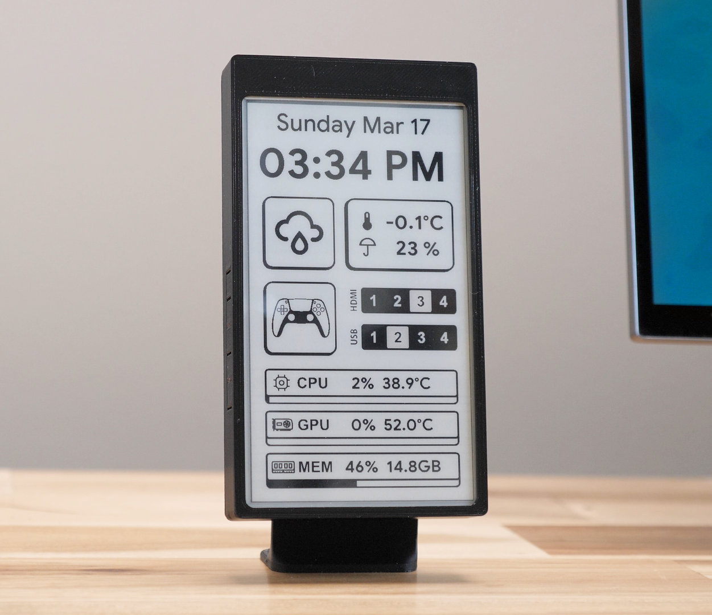
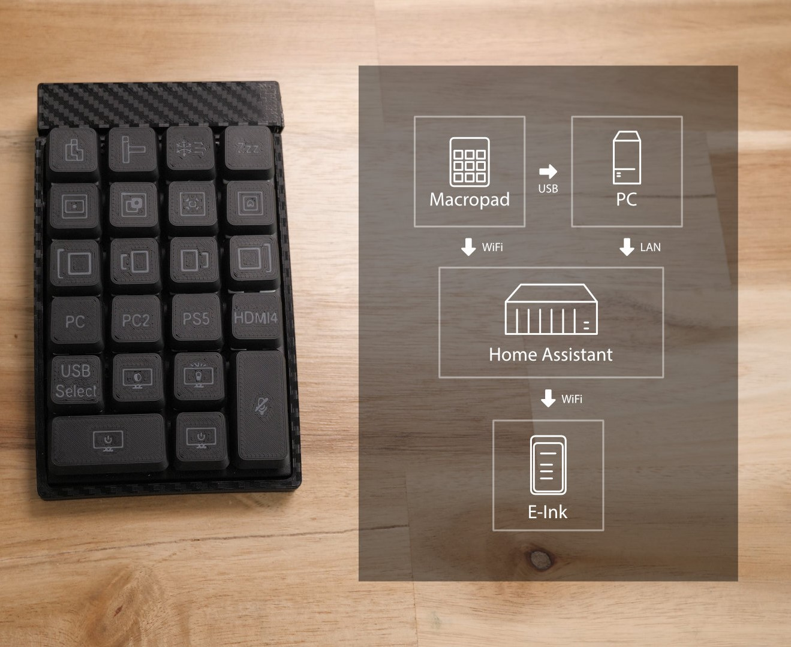

# E-ink Desk Display

I made this E-ink display for my computer desk setup as an Always On display to show me information such as the date, time, weather, HDMI settings, USB settings, and CPU/GPU/Memory temperature information.

You can see a demonstration of the E-ink Display on YouTube: [The E-ink Desk Accessory.](https://youtu.be/d9forDotXkI)

# Home Assistant Requirement
This E-ink display has ESPHome installed and retrieves all live data (timesync, weather, etc..) directly from the Home Assistant (HA) server. Only code for the E-ink display (ESPHome) has been provided. The following integrations/services were used on HA for their respective data: 
-  ESPHome (HA Integration)
-  OpenWeather (HA Integration)
-  Yahoo Finance (HACS Component)
-  Libre Hardware Monitor (Software on PC)
-  [My DIY Macropad](https://github.com/davidz-yt/desk-controller)

# Hardware
- LilyGo T5 4.7" Epaper ([Old Version Used](https://www.lilygo.cc/en-ca/products/t5-4-7-inch-e-paper), NOT New V2.3)
- Remixed 3D Printed Case based on this [3D Model](https://www.printables.com/model/272575-case-for-lilygo-t5-47-inch-e-paper)

# Credits and additional reading
I referred to the following (and more) to get this working.

https://github.com/esphome/feature-requests/issues/1109
https://www.reddit.com/r/homeassistant/comments/xt5vdj/the_lilygo_t5_bandwagon_fridge_display/
https://www.reddit.com/r/homeassistant/comments/rm71z4/lilygo_t5_epaper_display_now_using_esphome/
